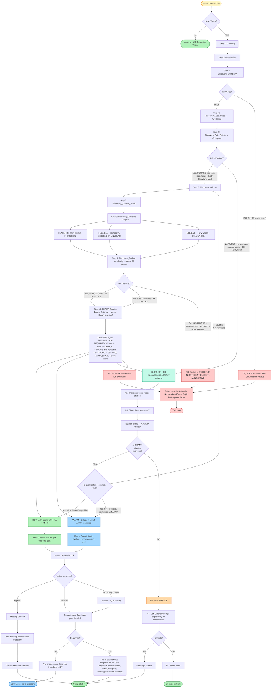

```mermaid
flowchart TD
    Start([Visitor Opens Chat]) --> NEW{New Visitor?}
    NEW -- "No" --> UC4([move to UC4: Returning Visitor])
    NEW -- "Yes" --> S1[Step 1: Greeting]

    S1 --> S2[Step 2: Introduction]
    S2 --> S3[Step 3: Discovery_Company]
    S3 --> ICP{ICP Check}

    ICP -- "PASS" --> S4["Step 4: Discovery_Use_Case → CH signal"]
    ICP -- "FAIL (adult/russia-based)" --> DQ_ICP

    S4 --> S5["Step 5: Discovery_Pain_Points → CH signal"]

    S5 --> CH_CHECK{CH = Positive?}

    CH_CHECK -- "Yes, DEFINED use case + pain points - likely Hot/Warm lead" --> S6[Step 6: Discovery_Volume]
    CH_CHECK -- "No, VAGUE - no use case, no pain points - CH: NEGATIVE" --> NURTURE

    S6 --> S7[Step 7: Discovery_Current_Stack]
    S7 --> S8["Step 8: Discovery_Timeline → P signal"]

    S8 --> S8_R["REALISTIC - few+ weeks - P: POSITIVE"]
    S8 --> S8_F["FLEXIBLE - 'someday' / exploring - P: UNCLEAR"]
    S8 --> S8_U["URGENT - < few weeks - P: NEGATIVE"]

    S8_R --> S9
    S8_F --> S9
    S8_U --> S9

    S9["Step 9: Discovery_Budget + Authority → A and M signals"]

    S9 --> M_CHECK{M = Positive?}
    M_CHECK -- "Yes, >= €5,000 EUR - M: POSITIVE" --> S10
    M_CHECK -- "'Not sure' / won't say - M: UNCLEAR" --> S10
    M_CHECK -- "No, < €5,000 EUR - INSUFFICIENT BUDGET - M: NEGATIVE" --> DQ_BUDGET

    S10["Step 10: CHAMP Scoring Engine (internal — never shown to visitor)"]

    S10 --> EVAL["CH/A/M/P Signal Evaluation - CH: REQUIRED. Without it → max = Nurture, A: STRONG. Hot vs Warm, M: STRONG. < €5k = DQ, P: MODERATE. Hot vs Warm"]

    EVAL --> HOT["HOT - All 4 positive CH + A + M + P"]
    EVAL --> WARM["WARM - CH pos + 1-2 of A/M/P confirmed"]
    EVAL --> NURTURE
    EVAL --> DQ_CHAMP

    NURTURE["NURTURE - CH weak/vague or all A/M/P missing"]

    DQ_CHAMP["DQ - CHAMP Negative + ICP exclusions"]
    HOT --> HOT_MSG["Hot: 'Great fit. Let me get you on a call.'"]
    WARM --> WARM_MSG["Warm: 'Something to explore. Let me connect you.'"]

    HOT_MSG --> CALENDLY[Present Calendly Link]
    WARM_MSG --> CALENDLY

    CALENDLY --> CAL_RESP{Visitor response?}
    CAL_RESP -- "Agrees" --> BOOKED[Meeting Booked]
    CAL_RESP -- "Declines" --> FORM_ASK["Contact form. Can I take your details?'"]
    CAL_RESP -- "No slots (5 days)" --> FALLBACK["fallback flag (internal)"]
    FALLBACK --> FORM_ASK

    BOOKED --> POST_BOOK[Post-booking confirmation message]
    POST_BOOK --> BRIEF[Pre-call brief sent to Slack]
    BRIEF --> DONE([Completed ✅])

    FORM_ASK --> FORM_RESP{Response?}
    FORM_RESP -- "No" --> FORM_ALT["'No problem. Anything else I can help with?'"]
    FORM_RESP -- "Yes" --> FORM_SUBMIT["Form submitted to Botpress Table. Data captured: visitor's name, email, company, message/question (internal)"]

    FORM_SUBMIT --> DONE
    FORM_ALT --> UC2_LINK([UC2: Visitor asks questions])
    NURTURE --> N1[N1: Share resources / case studies]
    N1 --> N2["N2: Check in — 'resonate?'"]
    N2 --> N3[N3: Re-qualify — CHAMP recheck]

    N3 --> N3_CHECK{"all CHAMP\nsignals\nimproved?"}
    N3_CHECK -- "Yes" --> QUAL_CHECK_UP{Is qualification_complete true?}
    N3_CHECK -- "No" --> N4_NO[N4: NO UPGRADE]

    QUAL_CHECK_UP -- "Yes, all 4 CHAMP = positive" --> HOT
    QUAL_CHECK_UP -- "Yes, CH + positive, confirmed 1 of A/M/P" --> WARM
    QUAL_CHECK_UP -- "No, only\nCH = positive" --> S6

    N4_NO --> N4_NUDGE["N4: Soft Calendly nudge - 'exploratory, no commitment'"]
    N4_NUDGE --> N4_ACC{Accepts?}
    N4_ACC -- "Yes" --> N4_CAL[Lead tag: Nurture]
    N4_ACC -- "No" --> N5[N5: Warm close]
    N4_CAL --> DONE
    N5 --> CLOSED([Closed positively])
    DQ_ICP["DQ: ICP Exclusion = FAIL (adult/russia-based)"] --> DQ_CLOSE
    DQ_BUDGET["DQ: Budget < €5,000 EUR INSUFFICIENT BUDGET - M: NEGATIVE"] --> DQ_CLOSE
    DQ_CHAMP --> DQ_CLOSE
    DQ_CLOSE["Polite close.No Calendly. No form.Lead Tag = DQ in the Botpress Table."]
    DQ_CLOSE --> DQ_END([DQ Closed])
    style Start fill:#fff3bf,stroke:#e67700
    style HOT fill:#b2f2bb,stroke:#2b8a3e
    style WARM fill:#a5d8ff,stroke:#1971c2
    style NURTURE fill:#c3fae8,stroke:#0ca678
    style DQ_ICP fill:#ffc9c9,stroke:#c92a2a
    style DQ_BUDGET fill:#ffc9c9,stroke:#c92a2a
    style DQ_CHAMP fill:#ffc9c9,stroke:#c92a2a
    style DQ_CLOSE fill:#ffc9c9,stroke:#c92a2a
    style DQ_END fill:#ffc9c9,stroke:#c92a2a
    style DONE fill:#b2f2bb,stroke:#2b8a3e
    style CLOSED fill:#b2f2bb,stroke:#2b8a3e
    style UC4 fill:#b2f2bb,stroke:#2b8a3e
    style UC2_LINK fill:#a5d8ff,stroke:#1971c2
    style HOT_MSG fill:#b2f2bb,stroke:#2b8a3e
    style WARM_MSG fill:#a5d8ff,stroke:#1971c2
    style N4_NO fill:#ffd8a8,stroke:#e8590c
```