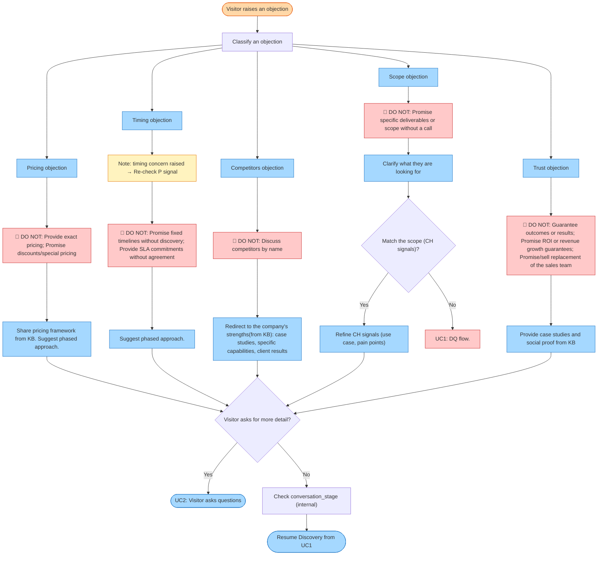

```mermaid
flowchart TD
    TRIGGER([Visitor raises an objection]) --> CLASSIFY[Classify an objection]

    %% Type 1: Pricing
    CLASSIFY --> PRICING[Pricing objection]
    PRICING --> P_GUARD["🔴 DO NOT: Provide exact pricing; Promise discounts/special pricing"]
    P_GUARD --> P_ACTION["Share pricing framework from KB. Suggest phased approach."]

    %% Type 2: Timing
    CLASSIFY --> TIMING[Timing objection]
    TIMING --> T_NOTE["Note: timing concern raised → Re-check P signal"]
    T_NOTE --> T_GUARD["🔴 DO NOT: Promise fixed timelines without discovery; Provide SLA commitments without agreement"]
    T_GUARD --> T_ACTION["Suggest phased approach."]

    %% Type 3: Competitors
    CLASSIFY --> COMP[Competitors objection]
    COMP --> C_GUARD["🔴 DO NOT: Discuss competitors by name"]
    C_GUARD --> C_ACTION["Redirect to the company's strengths(from KB): case studies, specific capabilities, client results"]

    %% Type 4: Scope
    CLASSIFY --> SCOPE[Scope objection]
    SCOPE --> SC_GUARD["🔴 DO NOT: Promise specific deliverables or scope without a call"]
    SC_GUARD --> SC_CLARIFY["Clarify what they are looking for"]
    SC_CLARIFY --> SC_CHECK{"Match the scope (CH signals)?"}
    SC_CHECK -- "Yes" --> SC_REFINE["Refine CH signals (use case, pain points)"]
    SC_CHECK -- "No" --> SC_DQ["UC1: DQ flow."]

    %% Type 5: Trust
    CLASSIFY --> TRUST[Trust objection]
    TRUST --> TR_GUARD["🔴 DO NOT: Guarantee outcomes or results; Promise ROI or revenue growth guarantees; Promise/sell replacement of the sales team"]
    TR_GUARD --> TR_ACTION["Provide case studies and social proof from KB"]

    %% Convergence
    P_ACTION --> DETAIL
    T_ACTION --> DETAIL
    C_ACTION --> DETAIL
    SC_REFINE --> DETAIL
    TR_ACTION --> DETAIL

    DETAIL{Visitor asks for more detail?}
    DETAIL -- "Yes" --> UC2([UC2: Visitor asks questions])
    DETAIL -- "No" --> STAGE["Check conversation_stage (internal)"]
    STAGE --> RESUME([Resume Discovery from UC1])

    %% Styling
    style TRIGGER fill:#ffd8a8,stroke:#e8590c
    style P_GUARD fill:#ffc9c9,stroke:#c92a2a
    style T_GUARD fill:#ffc9c9,stroke:#c92a2a
    style C_GUARD fill:#ffc9c9,stroke:#c92a2a
    style SC_GUARD fill:#ffc9c9,stroke:#c92a2a
    style TR_GUARD fill:#ffc9c9,stroke:#c92a2a
    style SC_DQ fill:#ffc9c9,stroke:#c92a2a
    style PRICING fill:#a5d8ff,stroke:#1971c2
    style TIMING fill:#a5d8ff,stroke:#1971c2
    style COMP fill:#a5d8ff,stroke:#1971c2
    style SCOPE fill:#a5d8ff,stroke:#1971c2
    style TRUST fill:#a5d8ff,stroke:#1971c2
    style P_ACTION fill:#a5d8ff,stroke:#1971c2
    style T_ACTION fill:#a5d8ff,stroke:#1971c2
    style C_ACTION fill:#a5d8ff,stroke:#1971c2
    style SC_CLARIFY fill:#a5d8ff,stroke:#1971c2
    style SC_REFINE fill:#a5d8ff,stroke:#1971c2
    style TR_ACTION fill:#a5d8ff,stroke:#1971c2
    style T_NOTE fill:#fff3bf,stroke:#e67700
    style UC2 fill:#a5d8ff,stroke:#1971c2
    style RESUME fill:#a5d8ff,stroke:#1971c2
```